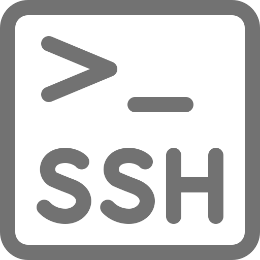

#
<p align="center">
  <a href="">
    
  </a>
  <h1 align="center">HQ-CLT01</h1>
</p>

## Setup Guide

- [X] General Configuration - [Click Here](https://github.com/Diogo-Rego/EuroSkills.2023.V2/tree/main/Module-A/Corporate%20HQ/hq-clt01#general-configuration)
  - [X] Set the hostname  - [Click Here](https://github.com/Diogo-Rego/EuroSkills.2023.V2/tree/main/Module-A/Corporate%20HQ/hq-clt01#set-the-hostname)
  - [X] Network configuration  - [Click Here](https://github.com/Diogo-Rego/EuroSkills.2023.V2/tree/main/Module-A/Corporate%20HQ/hq-clt01#configure-the-network-interface---ipv4)
  - [X] Set the time zone - [Click Here](https://github.com/Diogo-Rego/EuroSkills.2023.V2/tree/main/Module-A/Corporate%20HQ/hq-clt01#configure-the-time-zone)
  - [X] Set the keyboard layout - [Click Here](https://github.com/Diogo-Rego/EuroSkills.2023.V2/tree/main/Module-A/Corporate%20HQ/hq-clt01#configure-the-keyboard-layout)
  - [X] Install SSH server and allow root password access - [Click Here](https://github.com/Diogo-Rego/EuroSkills.2023.V2/tree/main/Module-A/Corporate%20HQ/hq-clt01#install-and-configure-the-ssh-server)
- [X] Preinstalled Resources - [Click Here](https://github.com/Diogo-Rego/EuroSkills.2023.V2/tree/main/Module-A/Corporate%20HQ/hq-clt01#preinstalled-resources)
  - [X] Install the test tools - [Click Here](https://github.com/Diogo-Rego/EuroSkills.2023.V2/tree/main/Module-A/Corporate%20HQ/hq-clt01#install-the-test-tools)
- [X] Install a graphic environment - [Click Here](https://github.com/Diogo-Rego/EuroSkills.2023.V2/tree/main/Module-A/Corporate%20HQ/hq-clt01#install-a-graphic-environment)
  - [X] Install tasksel - [Click Here](https://github.com/Diogo-Rego/EuroSkills.2023.V2/tree/main/Module-A/Corporate%20HQ/hq-clt01#install-a-desktop-environment)
  - [X] Install xrdp - [Click Here](https://github.com/Diogo-Rego/EuroSkills.2023.V2/tree/main/Module-A/Corporate%20HQ/hq-clt01#step-1-installing-desktop-environment)
- [ ] Install LDAP - [Click Here](https://github.com/Diogo-Rego/EuroSkills.2023.V2/tree/main/Module-A/Corporate%20HQ/hq-clt01#step-2-installing-xrdp-on-debian)
  - [ ] Configure LDAP authentication - [Click Here]()
- [X] Install Thunderbird - [Click Here](https://github.com/Diogo-Rego/EuroSkills.2023.V2/tree/main/Module-A/Corporate%20HQ/hq-clt01#install-thunderbird)

## General Configuration

<p align="center">
  <a href="">
    
  </a>
  <h1 align="center">Set the hostname</h1>
</p>

### Step 1: To set a new hostname

- Use the ``hostnamectl`` command with superuser privileges

````
sudo hostnamectl set-hostname new-hostname
````

Replace **'new-hostname'** with the desired hostname.

-  After running the command, you might need to restart your system for the changes to take effect:

````
sudo reboot
````

After the reboot, your Debian machine should be using the new hostname. To verify the new ``hostname``, you can use the hostname command:

````
hostname
````

#
<p align="center">
  <a href="">
    
  </a>
  <h1 align="center">Configure the Network Interface - IPV4</h1>
</p>

### Step 1: Identify Network Interfaces

- Determine the network interface names using the ip command or by checking the ``/etc/network/interfaces`` file. Common interface names are ``eth0`` for Ethernet and ``wlan0`` for wireless.

### Step 2: Edit Network Configuration File

- Open the network configuration file using a text editor:

````
sudo nano /etc/network/interfaces
````

### Step 3: Configure Network Interfaces

- Modify the file to define the network configuration for each interface. Here's an example configuration for a typical Ethernet interface (``eth0``):

````
# The loopback network interface
auto lo
iface lo inet loopback

# The primary network interface
auto eth0
iface eth0 inet static
    address 192.168.1.100   # Replace with your desired IP address
    netmask 255.255.255.0   # Replace with your subnet mask
    gateway 192.168.1.1     # Replace with your gateway IP address
    dns-nameservers 8.8.8.8 8.8.4.4   # Replace with your DNS servers
    dns-search example.com            # Replace with your name DNS servers
````

- If you are using DHCP to obtain IP address configuration automatically, you can use the following configuration instead:

````
auto eth0
iface eth0 inet dhcp
````

- Adjust the configuration based on your network requirements, including IP address, subnet mask, gateway, and DNS servers.

### Step 4: Save the file and exit the text editor.

### Step 5: Restart Networking Service

- Restart the networking service to apply the changes:

````
sudo systemctl restart networking
````

### Step 6: Verify Network Configuration

- Use the ``ip`` command or other network tools (``ifconfig``, ``ping``, etc.) to verify that the network interface is configured correctly and functioning as expected.

#
<p align="center">
  <a href="">
    
  </a>
  <h1 align="center">Configure the time zone</h1>
</p>

### Step 1: To view the list of available timezones

- Run the following command:

````
timedatectl list-timezones
````

This command will display a long list of timezones. Scroll through the output to find the desired timezone.

### Step 2: Once you have identified the desired timezone

- Use the following command to set it:

````
sudo timedatectl set-timezone [timezone]
````

Replace ``[timezone]`` with the timezone you want to configure. For example, to set the timezone to "Europe/Warsaw," the command would be:

### Step 3: After running the command

- ``timedatectl`` will update the system's timezone configuration.

### Step 4: To verify the changes

- Run the following command:

````
timedatectl
````

#
<p align="center">
  <a href="">
    
  </a>
  <h1 align="center">Configure the Keyboard Layout</h1>
</p>

### Step 1: Check the available keyboard layouts by running

````
sudo dpkg-reconfigure keyboard-configuration
````

1. You'll be presented with a configuration dialog that allows you to select your keyboard layout, keyboard model, and other options. Use the arrow keys to navigate and the spacebar to select options.

2. Once you have selected the desired keyboard layout and options, save the changes and exit the configuration dialog.

3. After making the changes, apply the new configuration by running:

````
sudo service keyboard-setup restart
````

OR

````
sudo reboot
````

#
<p align="center">
  <a href="">
    
  </a>
  <h1 align="center">Install and configure the SSH server</h1>
</p>


### Step 1: Install the OpenSSH Server

- Open a terminal on your Debian machine and use the following command to install the OpenSSH server:

````
sudo apt update
sudo apt install openssh-server
````

This will download and install the OpenSSH server on your system.

### Step 2: Configure Root Password Access

- Open the SSH server configuration file in a text editor:

````
sudo nano /etc/ssh/sshd_config
````

- Look for the line that says:

````
#PermitRootLogin prohibit-password
````

- Change it to:

````
PermitRootLogin yes
````

- Save the file and exit the text editor.

### Step 3: Restart the SSH Server:

After making the changes to the SSH configuration, you need to restart the SSH server for the changes to take effect:

````
sudo systemctl restart sshd
````

OR

````
sudo service sshd restart
````

## Preinstalled Resources

<p align="center">
  <a href="">
    
  </a>
  <h1 align="center">Install the test tools</h1>
</p>

### Step 1: For testing purpose

- All VM has been installed with the following test tools:

````
sudo apt install -y smbclient curl lynx dnsutils ldap-utils ftp lftp wget ssh nfs-common rsync telnet traceroute tcptraceroute tcpdump net-tools cifs-utils
````

## Install a graphic environment

<p align="center">
  <a href="">
    
  </a>
  <h1 align="center">Install a Desktop Environment</h1>
</p>

### Step 1: Installing Desktop Environment

By default, Debian Servers doesn’t have an installed Desktop Environment. XRDP server is designed to controls only desktop systems. So you will need to add a desktop environment to your system.

- Open a terminal and upgrade all installed packages with the following command:

```
sudo apt install tasksel
```

- After installing Tasksel, launch the Tasksel utility with the following command:

```
sudo tasksel
```

- You should see the following interface:


Use the arrow key to scroll down the list and find Debian Desktop Environment. Next, press the Space key to select it, also choose the Dekstop type, then press the Tab key to select OK then hit Enter to install the desktop environment.

- Once all the packages are installed, you will need to set your system boots into the graphical target. You can set it with the following command:

```
sudo systemctl set-default graphical.target 
```

Next, restart your system to apply the changes.

### Step 2: Installing XRDP on Debian

The Xrdp Debian packages are available under the default system repositories. You can install a remote desktop on your Debian system by executing the following command.

```
sudo apt install xrdp 
```

Once the xrdp installation finished successfully, its service will be started automatically. To verify the service status run the command:

```
sudo systemctl status xrdp 
```


The above output shows the Xrdp service is up and listening on port 3389.

### Step 3: Connect to Remote Desktop

The Xrdp service is successfully installed and ready to connect. On your Windows client, open the RDP client and enter the IP address of the Debian system.

- You can launch the RDP client by typing ``mstsc`` in the run window or command line.


The first time, it will prompt a warning message due to the remote system is unknown for your system. Check the box in front of “Don’t ask me again for connection to this computer” and click Yes to continue.


Once connected successfully, the remote system prompt for authentication. Enter the login credentials of the remote Debian system to get remote desktop access.


On successful authentication, you’ll get remote desktop access.


## Install Thunderbird

<p align="center">
  <a href="">
    
  </a>
  <h1 align="center">Install Thunderbird</h1>
</p>

### Step 1: Install Thunderbird on Debian 

Packages to install Thunderbird are by default available through the Debian 11 official repository, hence we don’t have to add any third-party repo. Just use the APT package manager to install it. However, the version available through it would not be the latest one.

```
sudo apt install thunderbird
```
