#
<p align="center">
  <a href="">
    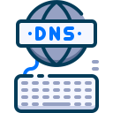
  </a>
  <h1 align="center">DK-DC</h1>
</p>

## Setup Guide

- [X] General Configuration - [Click Here]()
  - [X] Set the hostname  - [Click Here]()
  - [X] Network configuration  - [Click Here]()
  - [X] Set the time zone - [Click Here]()
  - [X] Set the keyboard layout - [Click Here]()
  - [X] Enable the remote desktop - [Click Here]()
  - [X] Allow ICMP traffic - [Click Here]()
- [ ] Install/Configure - [Click Here]()
  - [ ] Install AD DS - [Click Here]()
    - [ ] Create a child domain - [Click Here]()
  - [ ] Create an SMB based witness disk for Failover Cluster - [Click Here]()
  - [ ] Install RDS - [Click Here]()
    - [ ] Configure web-access for terminal services - [Click Here]()
    - [ ] The RDS login page should be accessible through https - [Click Here]()
    - [ ] Use certificates sign - [Click Here]()
    - [ ] Publish Notepad on web-portal - [Click Here]()

## General Configuration

<p align="center">
  <a href="">
    
  </a>
  <h1 align="center">Change the Hostname</h1>
</p>

### Changing the Windows Hostname

Detailed Instructions to Change Windows Hostname

1. Open the properties of Computer or My Computer or This PC based on your operating system version.

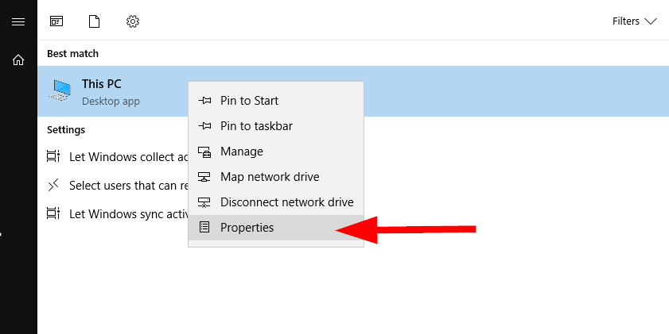

2. Click on ``change settings`` hyperlink under computer name, domain and workgroup settings section. See the below image:

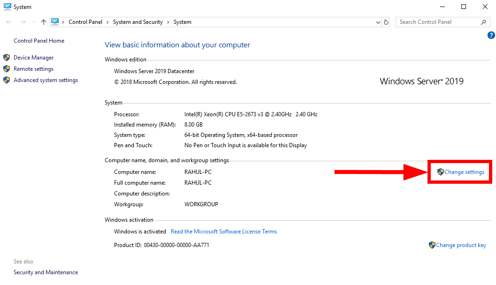

3. The above will open a new dialog box. In the ``Computer Name`` tab click ``Change`` button in front of “To rename this computer or change its domain or workgroup”.

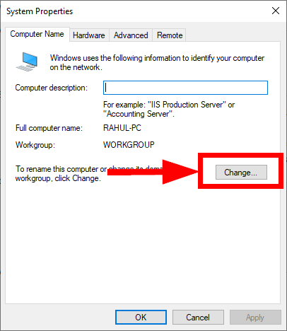

4. You will see another dialog box with an input box. Here set a new name for the Windows hostname and click ``OK``.

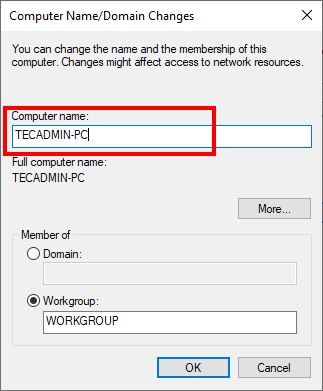

5. A dialog box will open to allow the system to reboot immediately or reboot it manually latest. Select an option of your choice.

In some of the operating system versions, You will not see a later reboot option. The system will ask you to save any unsaved files and restart the system immediately.

6. Once the Windows system rebooted, check the new hostname with a command prompt.

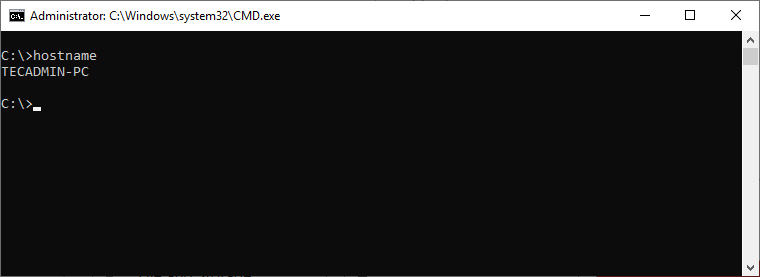

### How to Change Computer Name in PowerShell

1. Open PowerShell

Press ``“Windows + X”`` to open the Start menu flyout, then click ``“Windows PowerShell (Admin)”``.

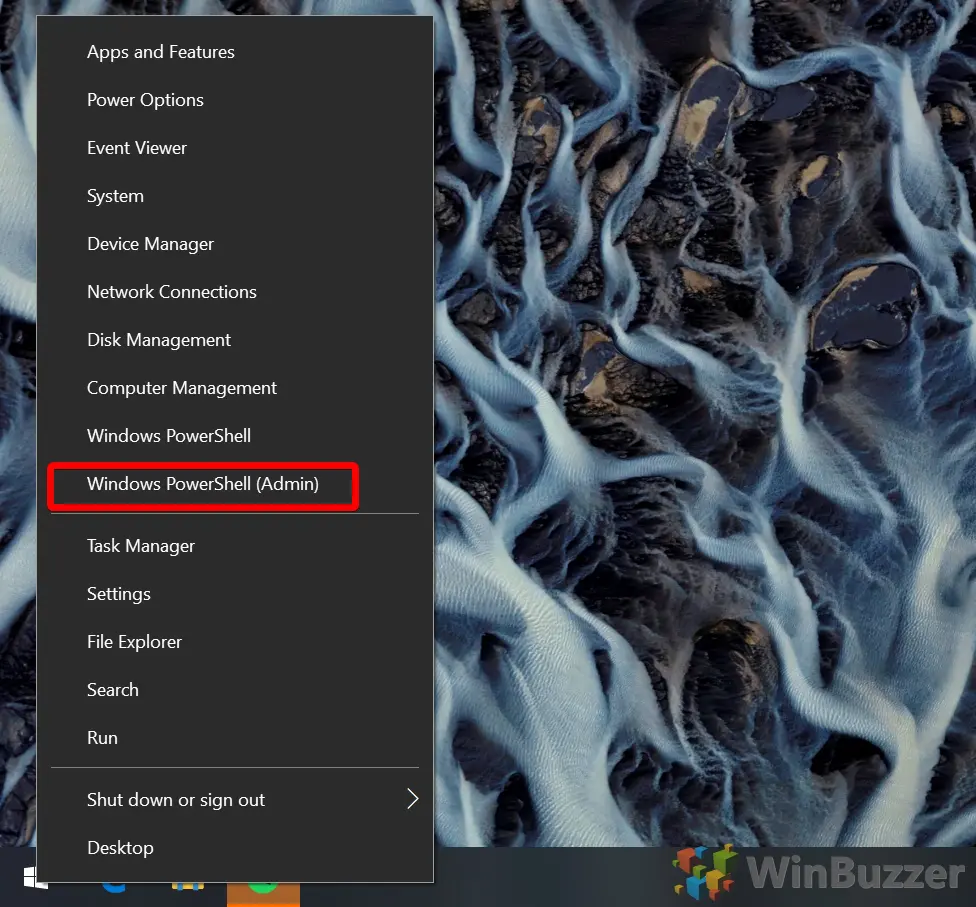

2. Type the PowerShell change computer name command

Enter the following in PowerShell and press “Enter”, substituting ‘Winbuzzer-Desktop' with your preferred name.

```
Rename-Computer -NewName "WINBUZZER-DESKTOP"
```

Restart your PC for the changes to take effect.

<p align="center">
  <a href="">
    
  </a>
  <h1 align="center">Configure the Network Interface</h1>
</p>

### Configure Ethernet Connection

1. Open the ``Control Panel`` from the Windows® icon in the lower left corner of your monitor.

In the Control Panel window, make sure ``View by`` is set to Category.

2. Click Network and Internet.


3. Click ``Network and Sharing Center``.


4. Click ``Change adapter settings`` in the left pane.


5. Sort the adapters by clicking the More options button, and then selecting ``Details``. Double-click the adapter to configure to open its properties.


On this computer, the adapter with the name ``Ethernet`` indicates connectivity to the Internet, but the connectivity of ``Ethernet 2`` indicates No network access. Double-click the ``Ethernet 2`` adapter to open its properties.

6. On the ``Networking`` tab, clear ``Clients for Microsoft Networks`` and ``File and Printer Sharing for Microsoft Networks``. These services can cause intermittent connection problems with USRP™ radios. To configure the IP address, double-click ``Internet Protocol Version 4 (TCP/IPv4)``.


7. On the ``General`` tab, the default setting is typically set to ``Obtain an IP address automatically``.


Select ``Use the following IP Address``. Set the host ``IP address`` to 192.168.10.X, where X is any integer from 1 to 255 except 2. Leave the ``Subnet mask`` set to its default (255.255.255.0).

If your radio is on another subnet, meaning the first three octets of the IP address field are not 192.168.30, then enter the IP address values of your radio for the first three octets


8. Click OK.

9. The host computer configuration is complete.

### Configure Ethernet Connection Via Windows Command Prompt

1. Based on the discovered radio IP address 192.168.30.7, assign an IP address to the Ethernet adapter from the same subnet, such as 192.168.30.1. Use a subnet mask of 255.255.255.0.

```
C:\>netsh interface ip set address "Ethernet 2" static 192.168.30.1 255.255.255.0
```

Verify that the updated IP address for the Ethernet adapter.

```
netsh interface ip show address "Ethernet 2"
```

Configuration for interface "Ethernet 2"
    DHCP enabled:    No
    IP Address:      192.168.30.1
    Subnet Prefix:   192.168.30.0/24 (mask 255.255.255.0)
    InterfaceMetric: 25

```
netsh interface ip set dns "Ethernet 2" static 8.8.8.8
```
OR
```
netsh interface ip set dns "Ethernet 2" static 8.8.8.8 index=2
```

<p align="center">
  <a href="">
    
  </a>
  <h1 align="center">Adjust Time Zone</h1>
</p>

### How to adjust time zone manually using Settings

To change the time zone settings manually on Windows 10, use these steps:

1. Open ``Settings``.

2. Click on ``Time & Language``.

3. Click on ``Date & time``.

4. Turn off the ``Set time zone automatically`` toggle switch (if applicable).

5. Use the "Time zone" drop-down menu and select the correct zone setting.

``Quick tip``: If you live in a region that uses daylight saving, make sure to turn on the "Adjust for daylight saving time automatically" toggle switch.

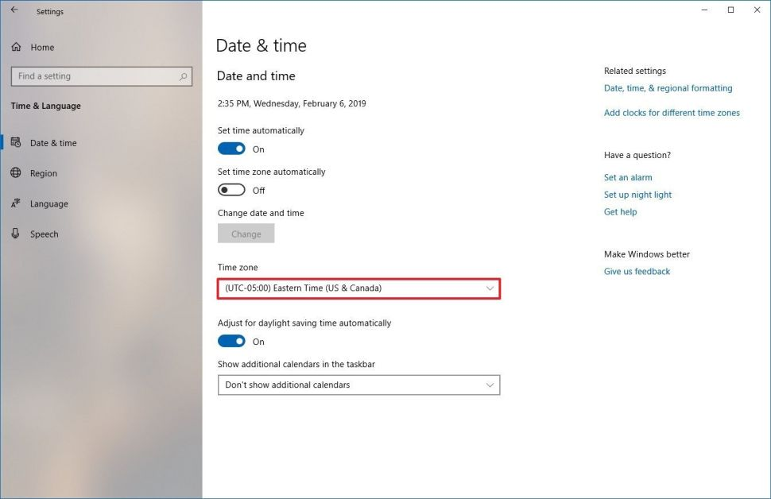

### How to adjust time zone using PowerShell

Alternatively, you can also use PowerShell to change the time zone on your device with these steps:

1. Open ``Start``.

2. Search for ``PowerShell``, right-click the top result, and select the ``Run as administrator`` option.

3. Type the following command to confirm the current time zone and press **Enter**: ``Get-TimeZone``

4. Type the following command and note the time zone that you want to use and press **Enter**: ``Get-TimeZone -ListAvailable``

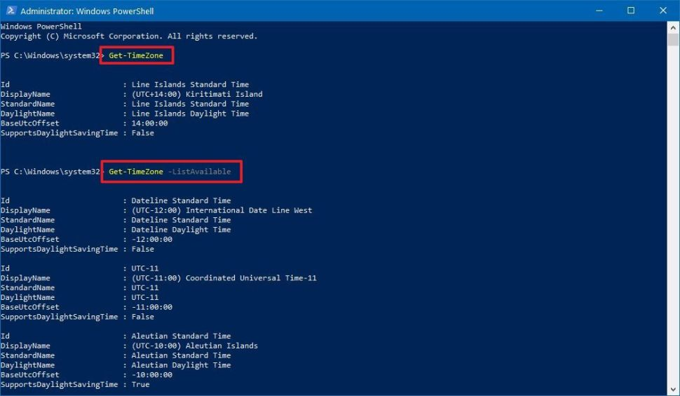

5. Type the following command to set the new time zone and press **Enter**: ``Set-TimeZone -Name "Line Islands Standard Time"`` 

In the command, make sure to change ``"Line Islands Standard Time"`` with the correct time zone that you noted in step No. 4. Also, make sure to type the full name exactly as shown in PowerShell.

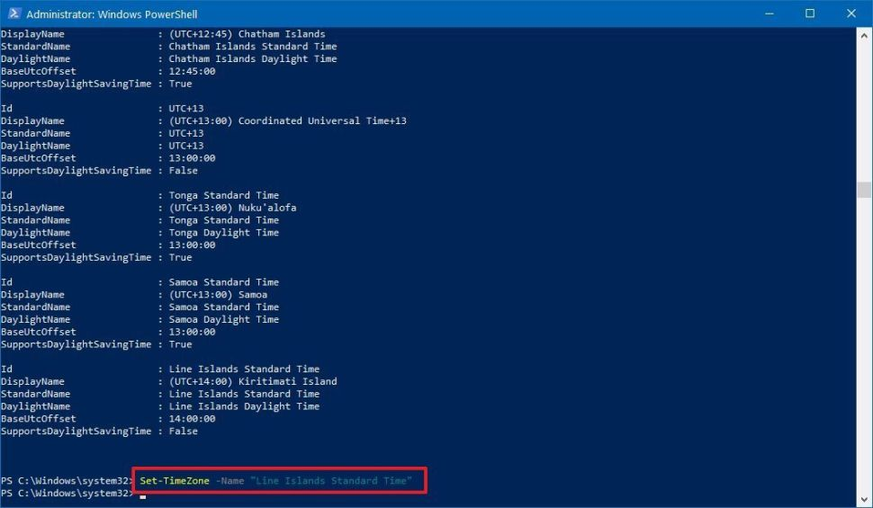

6. Type the following command to confirm the time zone was updated successfully and press **Enter:** ``Get-TimeZone``

<p align="center">
  <a href="">
    
  </a>
  <h1 align="center">Change the keyboard layout</h1>
</p>

### Changing the keyboard layout

To add a new keyboard layout on Windows, use these steps:

1. Open ``Settings``.

2. Click on ``Time & Language``.

3. Click on ``Language``.

4. Under the "Preferred languages" section, select the current 
default language (top in the list).

5. Click the ``Options`` button.


6. Under the "Keyboards" section, click the "``Add a keyboard``" button.

7. Select the new keyboard layout to add to Windows.


8. Repeat ``steps 6`` and ``7`` to add more layouts.

Once you complete the steps, the new keyboard layout will be added to the device, and you can switch between them using the instructions below.

While changing layouts is straightforward, it'll reconfigure some of the keyboard keys, which means some of the keys may print a different character depending on the layout.

To switch between keyboard layouts on Windows, use these steps:

1. Click the ``Input Indicator`` icon in Taskbar (bottom right).

2. Select the new keyboard layout.


### Remove the keyboard layout

To remove a keyboard layout on Windows 10, use these steps:

1. Open ``Settings``.

2. Click on ``Time & Language``.

3. Click on ``Language``.

4. Under the "Preferred languages" section, select the current default language (top in the list).

5. Click the ``Options`` button.


6. Under the "Keyboards" section, select the keyboard to remove from the list.

7. Click the ``Remove`` button.


8. Repeat ``steps 6`` and ``7`` to remove additional layouts.

Once you complete the steps, the keyboard layout will be removed from the device.

<p align="center">
  <a href="">
    
  </a>
  <h1 align="center">Enable the remote desktop</h1>
</p>


<p align="center">
  <a href="">
    
  </a>
  <h1 align="center">Allow ICMP traffic</h1>
</p>

### Accessing the Interface

There are a variety of ways to pull up the Windows Firewall with Advanced Security window. One of the most obvious is from the Windows Firewall control panel – click the Advanced settings link in the sidebar.

You can also type ``“Windows Firewall”`` into the search box in the Start menu and select the Windows Firewall with Advanced Security application.

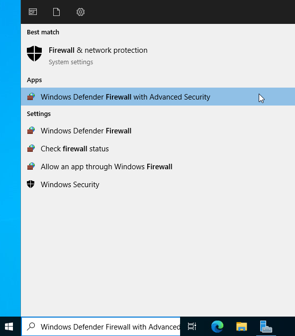

### Creating a Rule

To create a rule, select the ``Inbound Rules`` or ``Outbound Rules`` category at the left side of the window and click the Create Rule link at the right side.

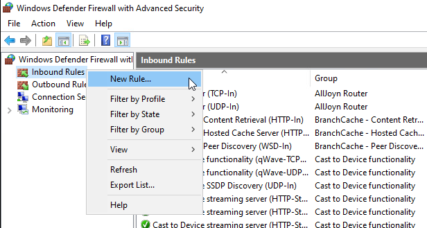

The Windows firewall offers four types of rules:

- **Program** – Block or allow a program.

- **Port** – Block or a allow a port, port range, or protocol.
Predefined – Use a predefined firewall rule included with Windows.

- **Custom** – Specify a combination of program, port, and IP address to block or allow.

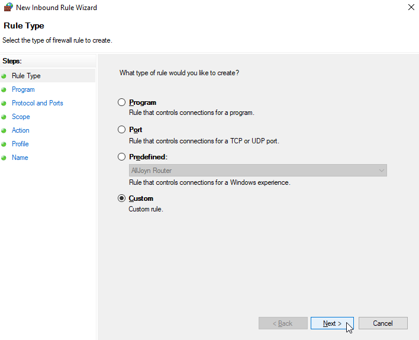

### Example Rule: Allow a Port

Let’s say we want to allow a specific port from communicating with the Internet.

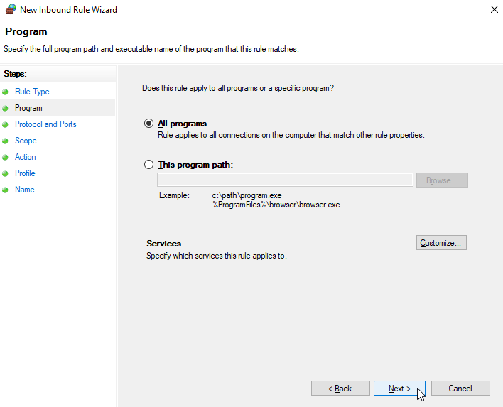

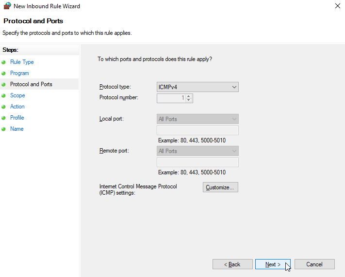

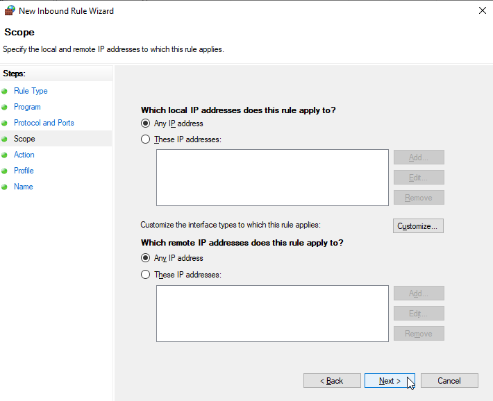

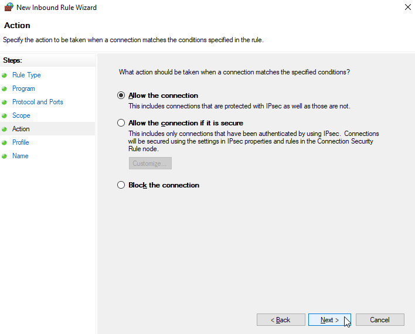

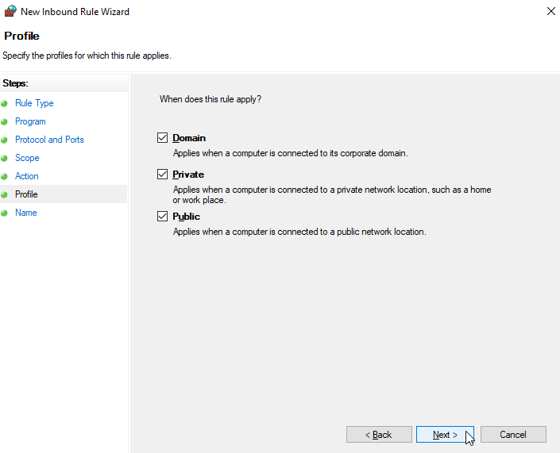

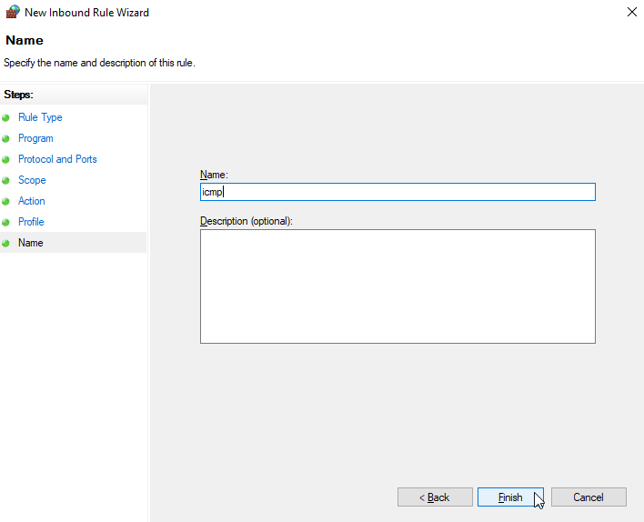

